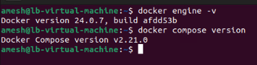

Nom du projet : Travail pratique 2 Luc Boivin
Date : 4 décembre 2023
Description du projet : Installation d'un système de conteneurs en respectant les recommandations du manufacturier, que sa configuration soit sécuritaire et démontrer sa fonctionnalité.

docker inspect ls
docker compose ps
docker network inspect tp2_mon_reseau
docker compose logs apache

